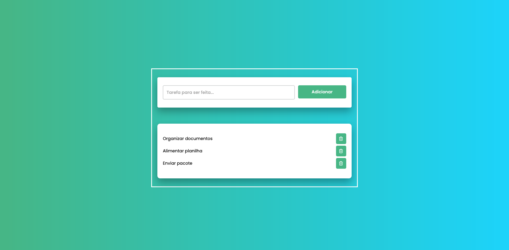

<h1 align="center"> Lista de tarefas </h1>

Programa exclusivo e gratuito, promovido por eu Mathias para a organização das suas tarefas diárias.  

  <a href="#-tecnologias">Tecnologias</a>&nbsp;&nbsp;&nbsp;|&nbsp;&nbsp;&nbsp;
  <a href="#-projeto">Projeto</a>&nbsp;&nbsp;&nbsp;|&nbsp;&nbsp;&nbsp;
  <a href="#-layout">Layout</a>&nbsp;&nbsp;&nbsp;|&nbsp;&nbsp;&nbsp;

 

  

## 🚀 Tecnologias

Esse projeto foi desenvolvido com as seguintes tecnologias:

- HTML e CSS
- JavaScript
- Git e Github
- Figma

## 💻 Projeto

O Lista de tarefas é um organizador de tarefas do seu dia a dia.

- [Acesse o projeto finalizado, online](https://main--gentle-sprite-246e26.netlify.app)

---

Feito com ♥ by Mathias Galdino :wave: